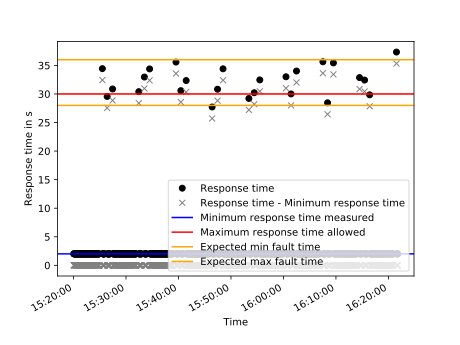

TODOs
--
- [x] Reference to published paper or online version of it
- [x] loadtest_plotter.py: Cleanup and reading data from files
- [ ] ARS_simulation.py: Cleanup, documentation and control workloads and parameters of the simulation model through CLI
- [x] locust-parameter-variation.py: Cleanup and Documentation
- [ ] Move the files into subfolders (Executors, Load Testers, Evaluators, Systems under Test)

Locust Performance Testing Infrastructure
---

In [[1]](https://www.doi.org/10.1007/978-3-030-68110-4_9) we introduced a 
generic performance testing infrastructure and used it in an industrial case study. 
Our idea is to have decoupled components, 
Python scripts in our case, that together allow to:

1. reproducible execute a load testing tool with a set of parameters for a particular experiment,
2. evaluate the performance measurements assisted by visualizations or automatic evaluators.

Generally, we have four types of components in our infrastructure:

* Executors: execute a particular Load Tester as long as the Load Tester provides a CLI or an API;
* Load Testers: execute the load test, parametrized with values given by an Executor. Have to output a logfile containing the response times;
* Evaluators: postprocess the logfile and for example plot the response times;
* Systems under Test (SUTs): Target systems we want to test. 
Usually, the target systems will be external systems, e.g., web servers. 
In our case, we build software that simulates the behavior of a real system, 
in order to provide the means for others to roughly reproduce our experiments.

More details about our generic performance testing infrastructure can be found in our paper [[1]](https://www.doi.org/10.1007/978-3-030-68110-4_9).

This repository contains the aforementioned Python scripts:

* Executors:
    * executor.py: executes Locust with a set of parameters;
    * locust-parameter-variation.py: executes Locust and keeps increasing the load.
    This is similar to Locust's [Step Load Mode](https://docs.locust.io/en/stable/running-locust-in-step-load-mode.html), 
    however, our approach increases the number of clients for as long as the ARS complies with real-time requirements
    in order to find the saturation point of the ARS. 
* Load Testers:
    * locust_tester.py: contains specific code for Locust to perform the actual performance test.
For demonstration purposes, this script tests ARS_simulation.py.
Outputs a `locust_log.log`;
    * locust_multiple_requests: an enhanced version of locust_tester that sends additional requests to generate more load.
    * locust_teastore.py: performs load testing against TeaStore, or our simulated TeaStore.
* Evaluators:
    * loadtest_plotter.py: reads the `locust_log.log`, plots response times, and additional metrics 
to better visualize, if the real-time requirements of the EN 50136 are met.
* SUTs
    * Alarm Receiving Software Simulation (ARS_simulation.py): simulates an industrial ARS 
based on data measured in the production environment of the GS company group.
    * TeaStore (teastore_simulation.py): simulates TeaStore based on a predictive model
generated in a lab environment.

# Instructions to reproduce results in our paper
## Quick start
* Clone the repository;
* run `pip3 install -r requirements.txt`;
* In the file `ARS_simulation.py` make sure that 
the constant `MASCOTS2020` is set to `True`.
* open two terminal shells:
  1. run `python3 ARS_simulation.py` in one of them;
  2. run `python3 executor.py.` in the other.
* to stop the test, terminate the executor.py script;
* run `python3 loadtest_plotter.py`, pass the locust_log.log and see the results. :)

## Details
Using the performance testing infrastructure available in this repository, 
we conducted performance tests in a real-world alarm system provided by the GS company.
To provide a way to reproduce our results without the particular alarm system,
we build a software simulating the Alarm Receiving Software.
The simulation model uses variables, we identified as relevant and also performed some measurements
in the production environment, to initialize the variables correctly.

To reproduce our results, follow the steps in the Section "Quick start". The scripts are already preconfigured,
to simulate a realistic workload, inject faults, and automatically recover from them.
The recovery is performed after the time, the real fault management mechanism requires.

If you follow the steps and, for example, let the test run for about an hour, 
you will get similar results to the ones you can find in the Folder "Tests under Fault".

Results after running our scripts for about an hour:



---

Keep in mind that we use a simulated ARS here; in our paper we present measurements performed with a real system, 
thus the results reproduced with the code here are slightly different.

Nonetheless, the overall observations we made in our paper, are in fact reproducible.

---

# Instructions on how to adapt our performance testing infrastructure to other uses
After cloning the repository, take a look at the `locust_tester.py`. This is, basically, 
an ordinary [Locust script](https://docs.locust.io/en/stable/writing-a-locustfile.html) 
that sends request to the target system and measures the response time, 
when the response arrives. Our locust_tester.py is special, because:

* we implemented a [custom client](https://docs.locust.io/en/stable/testing-other-systems.html) 
instead of using the default;
* we additionally log the response times to a logfile 
instead of using the [.csv files](https://docs.locust.io/en/stable/retrieving-stats.html) Locust provides.

So, write a performance test using Locust, following the instructions of the Locust developers
on how to write a Locust script. The only thing to keep in mind is, that your Locust script 
has to output the measured response times to a logfile in the same way our script does it. 
Use `logger.info("Response time %s ms", total_time)` to log the response times.

When you have your Locust script ready, execute it with `python3 executor.py`, 
pass the path to your script as argument, 
and when you want to finish the load test, terminate it with `Ctrl + C`.

Use `python3 executor.py --help` to get additional information.

Example call:
```
% python3 executor.py locust_scripts/locust_tester.py
```

After that, plot your results:

```
% python3 loadtest_plotter.py
Path to the logfile: locust_log.log
```